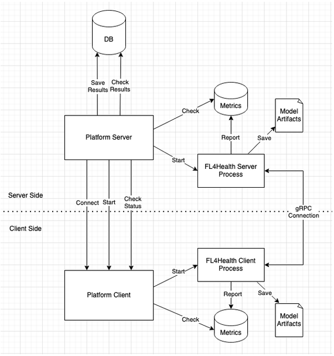

# FLorist

```{toctree}
:hidden:

user_guide
api

```

FLorist is a platform to launch and monitor Federated Learning (FL) training jobs. Its goal is
to bridge the gap between state-of-the-art FL algorithm implementations and their applications
by providing a system to easily kick off, orchestrate, manage, collect, and summarize the results
of [FL4Health](https://github.com/VectorInstitute/FL4Health) training jobs.

As Federated Learning has a client and a server side, FLorist also has client and server-side
“modes” to orchestrate the training process on both sides. FLorist will have long-running
processes on the clients, which will be waiting for instructions from the FLorist server to
start training. Once the FL server is started, FLorist will monitor both server and client
processes as well as its own FL server process while collecting their progress to be displayed
in a web UI for monitoring.

At the end of training, it will save the results in a database and also provide access to the
training artifacts (e.g. model files). For a visual representation of the system, please check
the diagram below.


